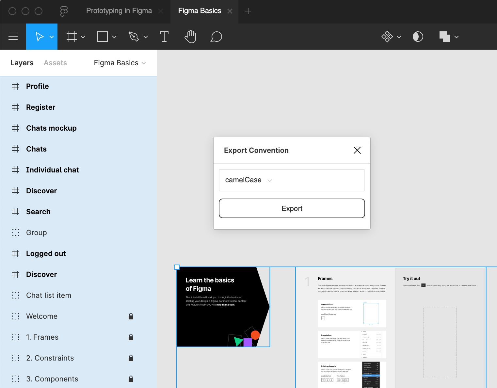
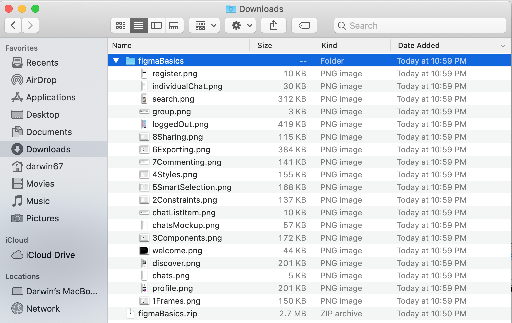

# Figma exporter plugin

This exporter plugin let's you select the convention you want your exported files to be named as.

The available conventions are,

* kebab-case
* snake_case
* camelCase

Or you can just export them as is if you prefer to keep you current filename structure.

## Usage

#### Choose a filename convention and hit the `Export` button.

#### Unzip the the downloaded zip and you should see the filenames are named with the chosen convention.

